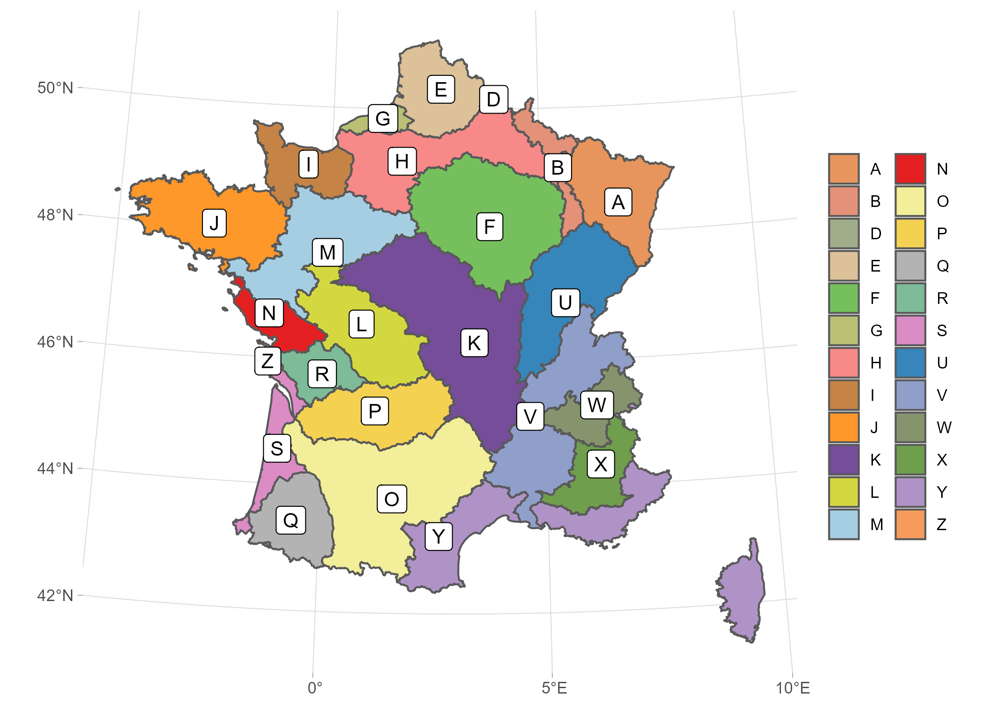

## About

The [INRAE hydrology team](https://webgr.inrae.fr/) has collected and formatted hydroclimatic data for `r nrow(meta_sta_en)` catchments over France. These data are summarized has graphical fact sheets.

### Contact

For any request or to report an error, contact:

-   [Olivier Delaigue](https://cv.hal.science/olivier-delaigue) (firstname.lastname\@inrae.fr)

### Citation

If you use these graphical fact sheets, please use the following reference to cite them in your publications:

-   DOI: [10.15454/UV01P1](https://doi.org/10.15454/UV01P1)

### Version

`r date_sheet`

### License

[Open License version 2.0](https://www.etalab.gouv.fr/licence-ouverte-open-licence/) 

## Graphical fact sheets

The files are available in French at medium resolution (1960 x 1386 pixels). They are available on request at high resolution (3267 x 2310 pixels), and with better color rendering. **An English version is now available.**

The first letter of the station codes is linked to the hydrological regions displayed on the following map.

